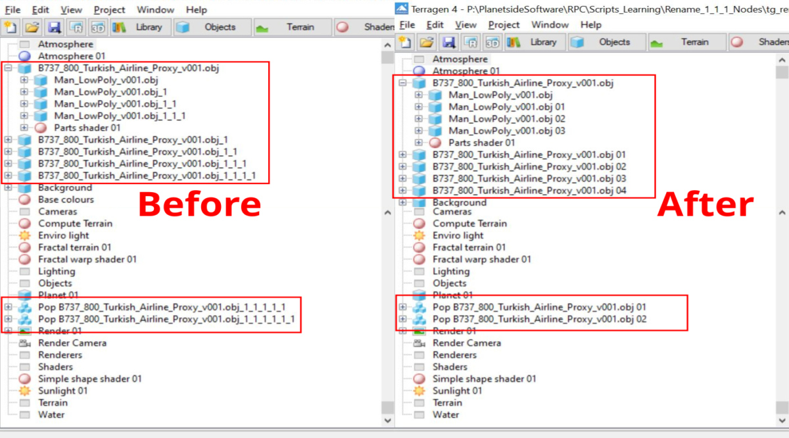
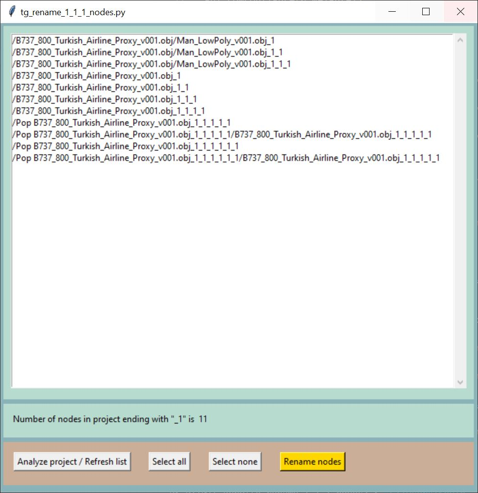

# tg-rename-1-1-1-nodes
A fully functional Python script implementing Terragen 4 Professional’s remote procedure call (RPC) feature to rename nodes in the active Terragen project with names ending in “_1”.  

In Terragen, whenever a node is duplicated or an item is loaded into the project with the same name as an existing item, the suffix “_1” is automatically appended to the name to keep it unique.  When there are many such items in the project, these names can seem unmanageable and not very descriptive.  This script attempts to remedy this situation by renaming nodes ending in “_1” with a more logical numeric extension.  

### Requirements:

Terragen 4 Professional v4.6.31 (or later)  
https://planetside.co.uk/

terragen-rpc  
https://github.com/planetside-software/terragen-rpc

### Installation:

Make sure you’ve installed Terragen 4 Professional v4.6.31 or greater on your computer, and installed the terragen_rpc module, via the pip install command.  

In this repository you’ll find the Python script “tg_rename_1_1_1_nodes.py” and supporting example content. The images folder contains an icon file, should you wish to create a shortcut on your desktop for the python script.  

### Usage:

This script irreversibly modifies the node names. Please back up your Terragen project before running this script.   

Click on the "Analyze project/Refresh list" button.  The script will read through the Terragen project looking for nodes that end in "_1" and display the results.  This may take awhile, depending on the number of nodes in your project.  

Select the nodes you want to rename.  Clicking the "Select all" button will select all the nodes, whilst clicking "Select none" will deselect all the nodes.  

Click the "Rename nodes" button to rename the selected nodes.  

### Known issues:

This has not been tested for cases when there might be more than 99 instances of a single item in the project.  
Would be nice to have a progress bar, as complex projects can take a while to process.  

### Reference:

terragen-rpc  
https://github.com/planetside-software/terragen-rpc  

Online documentation for Terragen RPC  
https://planetside.co.uk/docs/terragen-rpc/  

Blog posts on using Terragen RPC  
https://planetside.co.uk/blog/hello-rpc-part-1-scripting-for-terragen/  
https://planetside.co.uk/blog/hello-rpc-part-2-error-handling/  
https://planetside.co.uk/blog/script-it-yourself-kelvin-sunlight-colour-with-terragen-rpc/   

